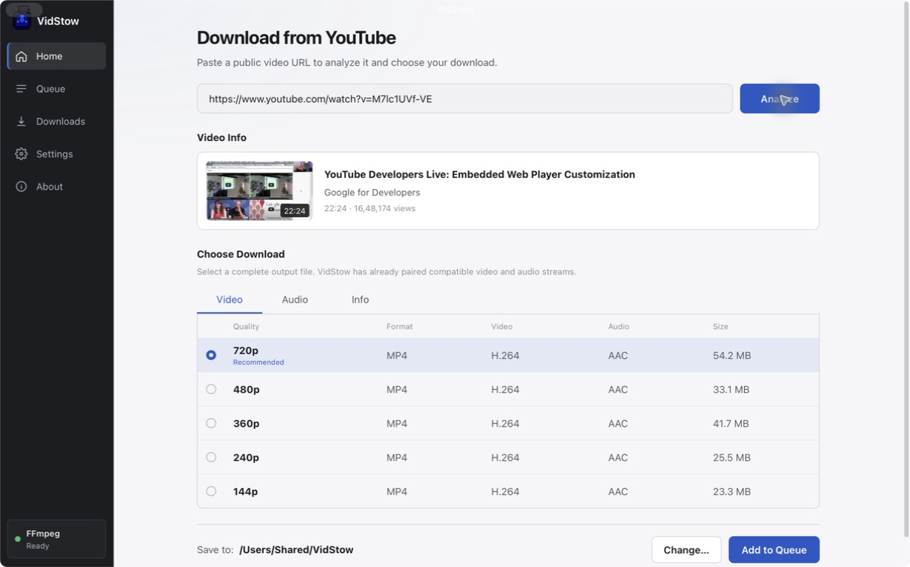
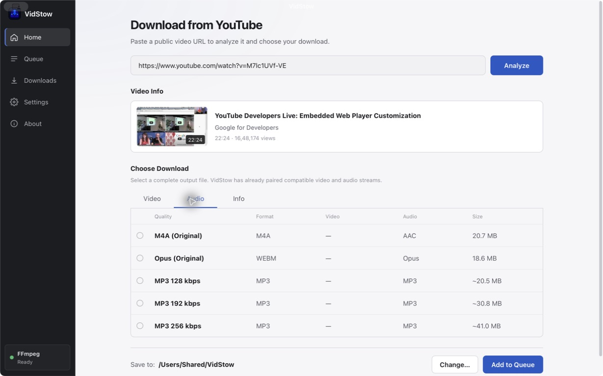
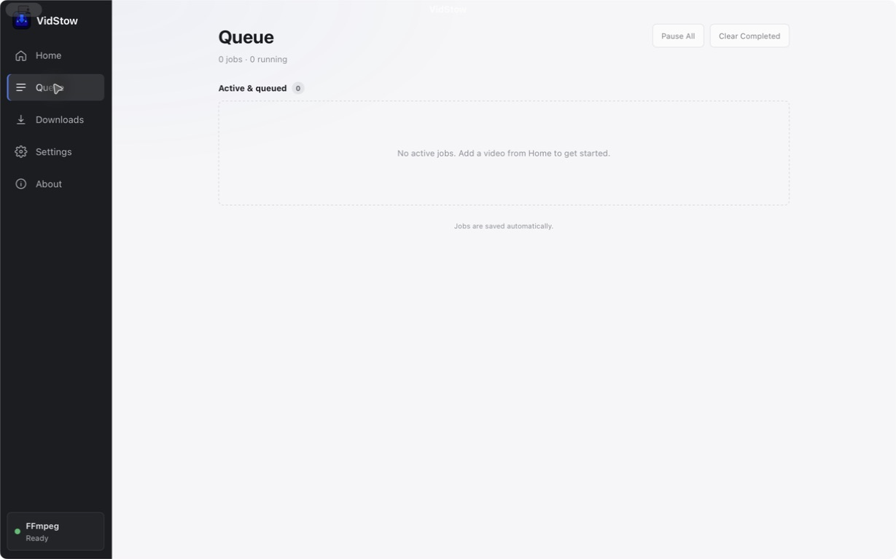
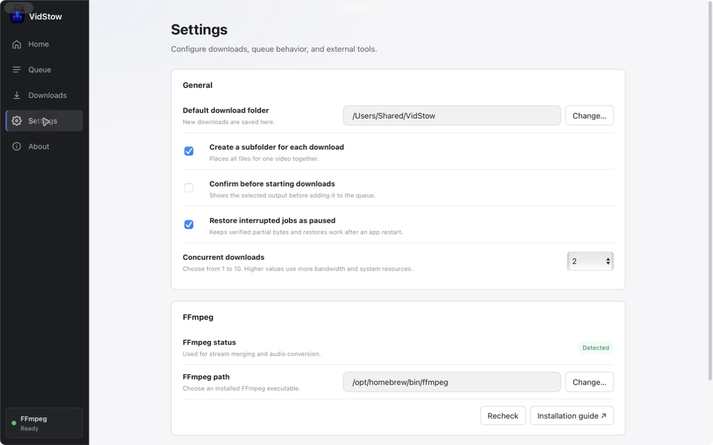
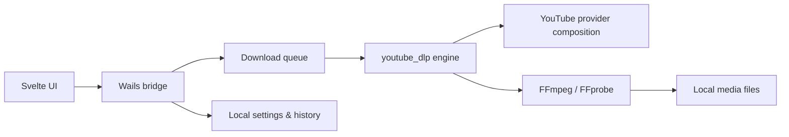

<div align="center">


# VidStow

### Save the videos you're allowed to keep—without living in a terminal.

A focused desktop downloader built with Go, Wails, and Svelte.

[](LICENSE)
[](go.mod)
[](https://wails.io/)
[](frontend/package.json)
[](https://github.com/tejasa97/youtube_dlp/releases/tag/v0.1.0)

[Download](#download) · [Features](#features) · [Screenshots](#screenshots) · [Quick start](#quick-start) · [How it works](#how-it-works) · [Contributing](CONTRIBUTING.md)

</div>



> [!IMPORTANT]
> VidStow is early-stage software. The UI intentionally supports public, single-video YouTube URLs; playlists, channels, search, live streams, Shorts, and other sites are not yet exposed. The first public builds are unsigned.

## Download

Grab the latest [GitHub Release](https://github.com/tejasa97/vidstow/releases/latest) once `v0.1.0` is published:

| Platform | Artifact |
| --- | --- |
| macOS Apple Silicon | `VidStow-0.1.0-darwin-arm64.zip` |
| macOS Intel | `VidStow-0.1.0-darwin-amd64.zip` |
| Windows | `VidStow-0.1.0-windows-amd64.zip` (portable) or `VidStow-0.1.0-windows-amd64-installer.exe` |
| Linux | `VidStow-0.1.0-linux-amd64.tar.gz` |

Every release also ships `SHA256SUMS`.

### First-run notes

- **FFmpeg** — install FFmpeg and FFprobe, or point VidStow at them in Settings.
- **macOS (unsigned)** — right-click the app → Open, or remove the quarantine attribute: `xattr -dr com.apple.quarantine /path/to/VidStow.app`.
- **Windows (unsigned)** — SmartScreen may warn on first launch; choose More info → Run anyway.
- **Linux** — extract the archive and run `./vidstow`. Keep `ytdlp-js-helper` beside the executable.
- **JavaScript helper** — release packages include `ytdlp-js-helper` next to the app binary. Do not delete it.

See [docs/RELEASE.md](docs/RELEASE.md) for packaging, signing status, and maintainer instructions.

## Why VidStow?

Downloading a video should not require memorising command-line flags. VidStow wraps a focused YouTube extraction engine in a small native desktop app with clear choices, persistent history, and understandable errors.

- **Purpose-built UI** — paste a URL, preview the video, choose a quality, and download.
- **Six useful presets** — Best, 4K, 1440p, 1080p, 720p, and audio only.
- **A real queue** — one active download at a time, with progress, speed, ETA, cancellation, retry, and removal.
- **Local history** — search past downloads and open or reveal completed files.
- **FFmpeg awareness** — automatic detection, custom-path support, and actionable setup guidance.
- **Focused by construction** — the app imports `engine` plus `providers/youtube`; it does not compile in the broad multi-site extractor catalog.

## Features

| Workflow | What VidStow provides |
| --- | --- |
| Analyze | Title, thumbnail, duration, and channel preview before downloading |
| Choose quality | Best, resolution-capped video, or audio-only presets |
| Download | Output-folder selection and FFmpeg-backed media processing |
| Queue | FIFO execution with progress, speed, ETA, cancellation, retry, and removal |
| History | Persistent, searchable download records with open and reveal actions |
| Diagnose | FFmpeg status, configurable binary path, and privacy-conscious diagnostics |

VidStow stores settings and download history in the operating system's user-config directory. It does not require an account or a hosted VidStow service.

## Screenshots

<table>
  <tr>
    <td width="50%">
      <strong>Audio formats</strong><br>
      Choose original audio or convert it to a familiar MP3 bitrate.<br><br>
      
    </td>
    <td width="50%">
      <strong>Persistent queue</strong><br>
      Track active and queued downloads from one focused workspace.<br><br>
      
    </td>
  </tr>
  <tr>
    <td colspan="2">
      <strong>Desktop settings</strong><br>
      Configure the output folder, concurrency, recovery behavior, and FFmpeg installation.<br><br>
      
    </td>
  </tr>
</table>

## Quick start

### Prerequisites

- [Go 1.25.12](https://go.dev/dl/) or newer
- [Node.js 20](https://nodejs.org/) or newer, with npm
- [FFmpeg](https://ffmpeg.org/download.html) available on `PATH`, or configured in VidStow
- [Wails CLI v2](https://wails.io/docs/gettingstarted/installation/) for native development and packaging

Install the pinned Wails CLI:

```sh
go install github.com/wailsapp/wails/v2/cmd/wails@v2.13.0
```

### Run locally

```sh
git clone https://github.com/tejasa97/vidstow.git
cd vidstow

cd frontend
npm ci
cd ..

wails dev
```

### Build the desktop app

```sh
wails build
```

The native artifact is written beneath `build/bin/`. On macOS, the post-build hook also builds and verifies the matching `ytdlp-js-helper` beside the app executable.

## How it works



VidStow consumes the provider-neutral [`youtube_dlp`](https://github.com/tejasa97/youtube_dlp) engine at [`v0.1.0`](https://github.com/tejasa97/youtube_dlp/releases/tag/v0.1.0). Both metadata analysis and downloads use the same explicit YouTube composition.

The UI is the product boundary: if a workflow appears in VidStow, it is supported by VidStow. The underlying provider package can evolve independently without silently exposing new workflows in the desktop application.

## Development

Run the complete validation suite before submitting a change:

```sh
go mod tidy -diff
go vet ./...
go test -count=1 ./...
go test -race -count=1 ./...
go build ./...

cd frontend
npm ci
npm run check
npm run test:ui
npm run build
```

See [CONTRIBUTING.md](CONTRIBUTING.md) for project conventions and dependency-boundary requirements. Generated Wails bindings under `frontend/wailsjs/` are intentionally not tracked.

## Project scope

VidStow deliberately starts narrow. Today, an option shown in the UI is an option the application supports. New providers or YouTube workflows should be added by importing the relevant provider package and designing the corresponding end-user experience—not by enabling hidden runtime gates.

## Responsible use

Use VidStow only for content you own or are authorized to download. You are responsible for following applicable laws, rights-holder permissions, and platform terms.

VidStow is an independent open-source project. It is not affiliated with, endorsed by, or sponsored by YouTube or Google.

## History and license

VidStow was extracted with filtered Git history from the former `apps/desktop` subtree of [`tejasa97/youtube_dlp`](https://github.com/tejasa97/youtube_dlp). The relevant commits and their original authorship are preserved.

Licensed under the [Apache License 2.0](LICENSE). See [NOTICE](NOTICE) for attribution details.
