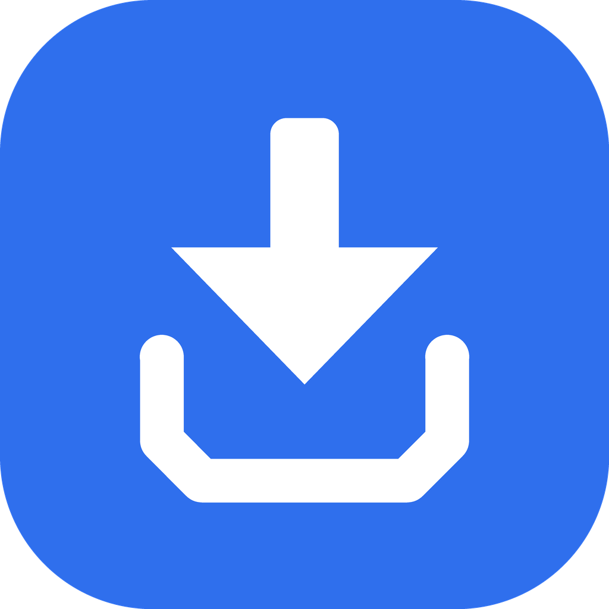
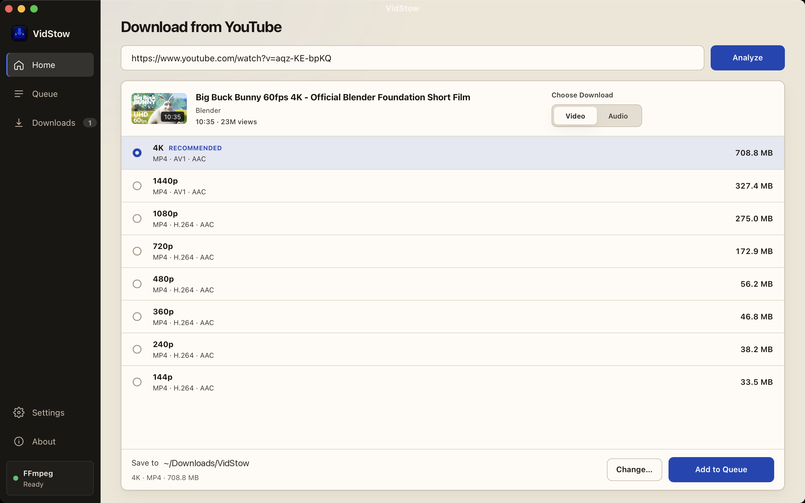
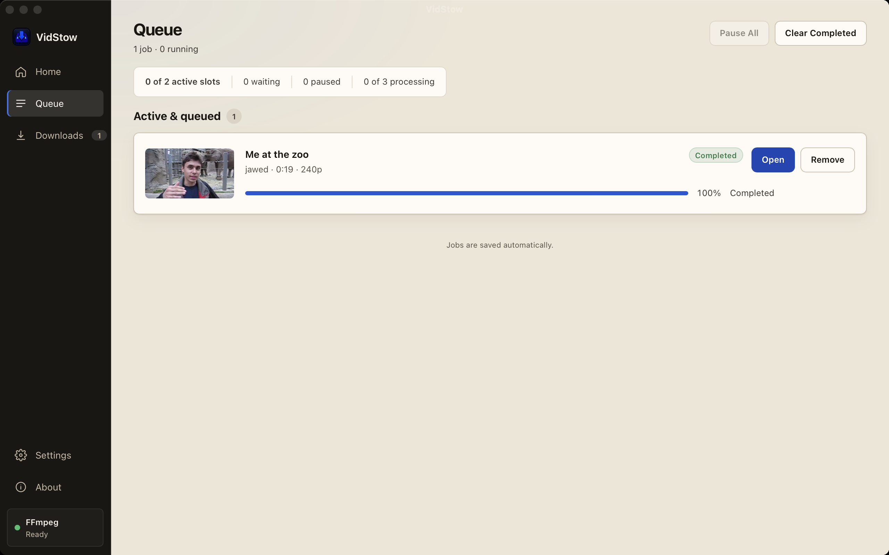
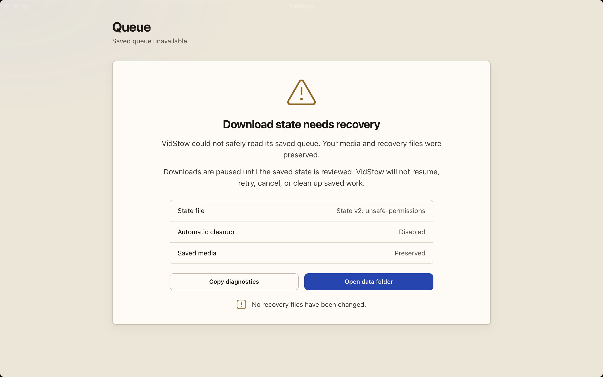
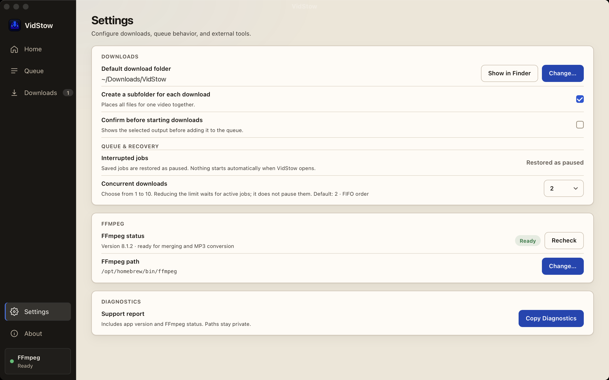
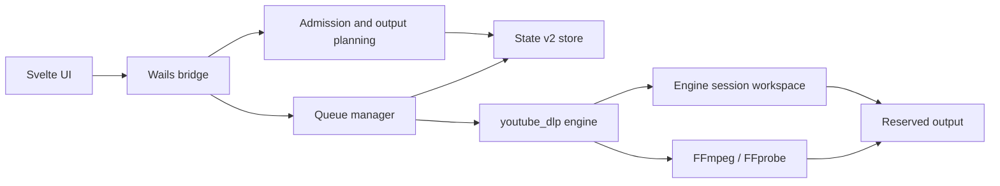

<div align="center">



# VidStow

### Download public YouTube videos with a focused desktop queue.

A local desktop application built with Go, Wails, and Svelte.

[](#project-status)
[](LICENSE)
[](go.mod)
[](https://wails.io/)
[](frontend/package.json)
[](go.mod)

[Download](#download) · [Features](#features) · [Screenshots](#screenshots) · [Project status](#project-status) · [Run locally](#run-locally) · [How it works](#how-it-works) · [Contributing](CONTRIBUTING.md)

</div>



> [!IMPORTANT]
> VidStow is beta software for public, on-demand YouTube video, Short, and playlist URLs.
> Channels, search, live streams, authenticated downloads, and other
> sites are outside the supported application scope.

## Download

VidStow can be built from the Apache-2.0 source using the
[local build instructions](#run-locally). When `v0.1.0-beta.1` is published, it
will also provide a prebuilt `VidStow-0.1.0-beta.1-darwin-arm64.zip` for macOS
Apple Silicon.

The beta release will include `SHA256SUMS` and build metadata identifying the
exact source revision and engine dependency. FFmpeg and FFprobe are external
requirements. Updates are installed manually from the project's GitHub Releases
page.

Windows, Linux, and macOS Intel packages are outside the supported release
scope. See the [release guide](docs/RELEASE.md) for artifact packaging and
verification details.

## Features

- **Analyze before downloading** — inspect the title, thumbnail, duration,
  channel, and available output choices.
- **Focused output choices** — choose best available video, capped resolutions,
  original audio, or MP3 when the analyzed media supports those choices.
- **Playlist review** — select up to 500 available entries, apply a bounded
  range, and admit the collection as one expandable parent with individual jobs.
- **FIFO queue** — configure 1–10 concurrent downloads; the default is 2.
- **Explicit lifecycle controls** — each queue row presents only the Pause,
  Resume, Cancel, Retry, Open, or removal actions authorized by the application;
  Pause All is available for eligible queued work.
- **Durable application state** — State v2 stores queue lifecycle, settings,
  reservations, history, and pending cleanup obligations.
- **Conservative recovery** — corrupt, unsafe, contended, unavailable, or
  indeterminate evidence does not authorize automatic destructive mutation.
- **Destination reservations** — related artifacts for a job receive one
  collision decision, and an unrelated destination is not silently replaced.
- **External FFmpeg support** — VidStow detects FFmpeg and FFprobe on `PATH` or
  validates a user-selected FFmpeg/FFprobe pair.
- **Focused engine composition** — the desktop application supports only its
  explicitly exposed YouTube workflow, not the engine's wider extractor catalog.

### Lifecycle boundaries

VidStow persists logical job, execution-attempt, and engine-session identities
separately. Pause requests are cooperative: a transfer may settle as paused,
while work already finalizing may complete. Resume and Retry enqueue work; reuse
of retained bytes depends on the exact engine release, selected protocol, and
valid session evidence. VidStow does not promise universal continuation or byte
reuse.

Cancel requests engine-session discard. If cleanup cannot be proved complete,
the application retains a cleanup obligation or reports that user action is
required instead of claiming success.

## Screenshots

<table>
  <tr>
    <td width="50%">
      <strong>Lifecycle queue</strong><br>
      Inspect paused, failed, canceled, and completed rows from one workspace.
      The examples use Blender Foundation open movies.<br><br>
      
    </td>
    <td width="50%">
      <strong>Recovery-required state</strong><br>
      Unsafe or unreadable application state disables ordinary queue mutation
      and preserves available recovery evidence for review.<br><br>
      
    </td>
  </tr>
  <tr>
    <td colspan="2">
      <strong>Queue and recovery settings</strong><br>
      Select the output folder and concurrency limit and verify FFmpeg status.<br><br>
      
    </td>
  </tr>
</table>

## Project status

VidStow is beta software. Supported behavior is bounded by the exact
application and engine versions and by artifact-specific validation.

| Area | Supported boundary |
| --- | --- |
| Product | Beta; focused public YouTube video and playlist workflow |
| Package | `v0.1.0-beta.1` will provide a macOS Apple Silicon preview when published |
| Source | Apache-2.0 source and self-build instructions |
| Queue | State v2 persistence, revision-checked lifecycle transitions, FIFO admission, and startup reconciliation |
| Engine | `go.mod` pins `github.com/tejasa97/youtube_dlp v0.2.0` |
| Resume | Session reuse is evidence-dependent; no universal transfer continuation or guaranteed byte reuse |
| Updates | Manual downloads from GitHub Releases |

The underlying [`youtube_dlp`](https://github.com/tejasa97/youtube_dlp)
project has broader extractor and CLI capabilities. VidStow supports only the
workflow documented here and exposed by its desktop UI.

## Prerequisites

- [Go 1.25.12](https://go.dev/dl/)
- [Node.js 22](https://nodejs.org/) with npm
- [FFmpeg and FFprobe](https://ffmpeg.org/download.html) on `PATH`, or a
  user-selected FFmpeg executable with matching FFprobe beside it
- [Wails CLI v2.13.0](https://wails.io/docs/gettingstarted/installation/)

Install the pinned Wails CLI:

```sh
go install github.com/wailsapp/wails/v2/cmd/wails@v2.13.0
```

## Run locally

```sh
git clone https://github.com/tejasa97/vidstow.git
cd vidstow

cd frontend
npm ci
cd ..

wails dev
```

## Build the desktop app

```sh
wails build
```

The native artifact is written beneath `build/bin/`. A JavaScript helper used
by the pinned engine is built and verified by the repository's packaging hooks;
it must remain in the location expected by the resulting application bundle or
binary layout.

## How it works



VidStow owns the desktop workflow, queue scheduling, State v2 application
lifecycle, destination reservations, recovery presentation, and UI. The engine
owns extraction, transport, protocol-specific session evidence, media
processing, and output-publication primitives. State v2 and an engine session
manifest are separate authorities; neither substitutes for the other.

The manager produces the queue view and action capabilities consumed by the
frontend. The frontend presents those capabilities rather than inferring
lifecycle authority from status text.

## Local data and privacy

VidStow stores application state in the operating system's per-user
configuration directory. State v2 can include:

- settings, including the selected download folder and an optional FFmpeg path;
- canonical public YouTube watch URLs and video IDs;
- display metadata such as title, channel, duration, and selected quality;
- job, attempt, session, queue, lifecycle, reservation, and cleanup records;
- completed-download history, including output paths and media metadata.

Engine session work is stored beneath an engine-owned hidden directory in the
selected output root.

State v2 must not persist media delivery URLs, request headers, cookies,
credentials, signed query parameters, or media encryption keys. VidStow does
not require a hosted account and does not provide cloud sync. Normal operation
contacts YouTube and its media or thumbnail hosts, and may start the locally
installed FFmpeg/FFprobe tools when the selected output requires them.

Errors shown by lifecycle and recovery views are bounded for presentation, but
users should review diagnostic material before sharing it.

## Development

Run the validation suite before submitting a change:

```sh
cd frontend
npm ci
npm run check
npm run test:ui
npm run build
cd ..

go mod tidy -diff
go vet ./...
go test -count=1 ./...
go test -race -count=1 ./...
go build ./...
```

See [Architecture](docs/ARCHITECTURE.md) for ownership and trust boundaries,
and [CONTRIBUTING.md](CONTRIBUTING.md) for project conventions and
dependency boundaries. Generated Wails bindings under `frontend/wailsjs/` are
intentionally not tracked.

## Scope and limitations

VidStow does not support:

- channels, search, live streams, or authenticated workflows;
- sites other than YouTube;
- DRM decryption or access-control circumvention;
- universal resumability or byte reuse when media equivalence is unproved;
- treating cleanup, publication, or recovery as successful when evidence is
  uncertain;
- automatic updates or packages outside macOS Apple Silicon; or
- feature parity with yt-dlp or the broader `youtube_dlp` CLI.

## Responsible use

Use VidStow only for content you own or are authorized to download. You are
responsible for following applicable laws, rights-holder permissions, and
platform terms.

VidStow is an independent open-source project. It is not affiliated with,
endorsed by, or sponsored by YouTube, Google, yt-dlp, or any supported service.

## License

Licensed under the [Apache License 2.0](LICENSE). See [NOTICE](NOTICE) for
attribution details.
