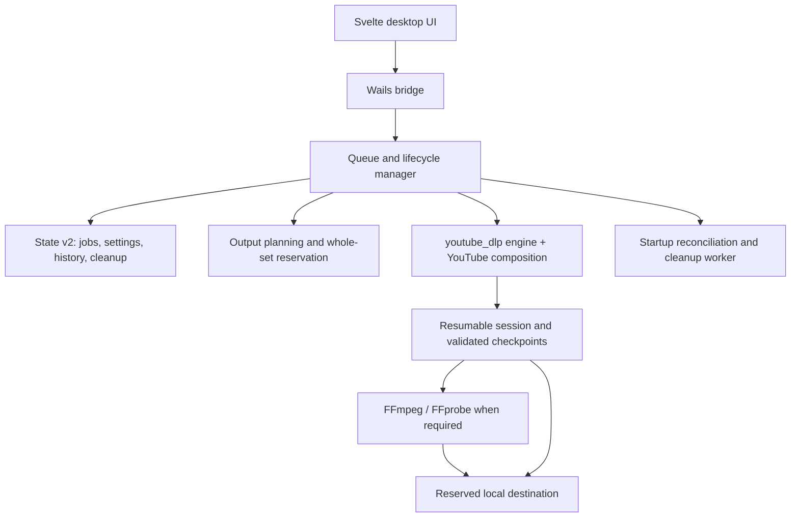

<div align="center">


# VidStow

### Download public YouTube videos with a desktop queue you can understand.

A focused, local-first downloader built with Go, Wails, and Svelte.

[](#project-status)
[](LICENSE)
[](go.mod)
[](https://wails.io/)
[](frontend/package.json)
[](https://github.com/tejasa97/youtube_dlp/tree/v0.2.0)

[Why VidStow?](#why-vidstow) · [Features](#features) · [Screenshots](#screenshots) · [Run locally](#run-locally) · [How it works](#how-it-works) · [Contributing](CONTRIBUTING.md)

</div>


> [!IMPORTANT]
> VidStow is early-stage software with a deliberately narrow product surface.
> It currently supports public, on-demand, single-video YouTube URLs. Playlists,
> channels, search, live streams, Shorts-specific workflows, authenticated
> downloads, and other sites are not exposed by the desktop application.

## Why VidStow?

Downloading a video should not require memorising command-line flags or
wondering what happened to a background task. VidStow wraps a focused native
YouTube engine in a desktop workflow with clear output choices, a durable
queue, local history, and explicit recovery states.

- **Focused workflow** — paste a public YouTube URL, inspect it, choose an
  output, and download.
- **Useful output choices** — Best, 4K, 1440p, 1080p, 720p, original audio,
  and MP3 options where the selected media supports them.
- **A real concurrent queue** — FIFO scheduling with configurable concurrency
  from 1–10 downloads and a default of 2.
- **Explicit lifecycle controls** — Pause, Resume, Pause All, Cancel, Retry,
  removal, and bounded pause-and-quit behavior.
- **Durable local state** — queue lifecycle, settings, reservations, history,
  and pending cleanup obligations are stored together in a versioned State v2
  file.
- **Conservative recovery** — interrupted work is never silently guessed into
  success. Unsafe, corrupt, contended, or indeterminate evidence is surfaced
  as recovery-required instead of being deleted.
- **Safe destination selection** — complete output sets are reserved together
  against the selected root so sidecars and primary media cannot receive
  mismatched collision suffixes.
- **Focused by construction** — VidStow imports `engine` plus
  `providers/youtube`; it does not compile in the engine's broad multi-site
  catalog.
- **Local-first** — no VidStow account, hosted queue, or cloud library is
  required.

## Features

| Workflow | What VidStow provides |
| --- | --- |
| Analyze | Title, thumbnail, duration, channel, and available output plans before download |
| Choose output | Resolution-capped video, best available output, original audio, or MP3 conversion |
| Queue | FIFO scheduling, configurable concurrency, truthful slot occupancy, progress, speed, and ETA |
| Pause and Resume | Typed pause intent with retained work where the engine can validate it |
| Cancel | Stops the job and discards resumable session work; cleanup obligations remain visible until settled |
| Retry | Retries a failed logical job using validated retained evidence when safe |
| Restart recovery | Reconciles durable queue and engine evidence before any worker or cleanup task starts |
| History | Persistent, searchable completed-download records with open and reveal actions |
| Destinations | Root-identity validation, whole-output reservation, and no silent overwrite |
| FFmpeg | Automatic detection, custom-path support, bounded process cancellation, and actionable setup guidance |
| Diagnostics | Persistence health, recovery-required mode, FFmpeg status, and privacy-conscious error reporting |

### Lifecycle at a glance

```text
Pending ── Pause ────────────────► Paused
   │                                  │
   └── worker slot ─► Downloading ────┤ Resume
                          │            ▼
                          ├── error ─► Failed ── Retry
                          ├── Pause ─► Paused
                          ├── Cancel ► Canceled
                          └──────────► Completed ── Open / Reveal
```

A job continues to occupy its worker slot while pausing, canceling, or
finalizing. Lowering concurrency drains naturally and never interrupts an
active job merely to satisfy the new limit.

## Screenshots

<table>
  <tr>
    <td width="50%">
      <strong>Durable lifecycle queue</strong><br>
      Resume interrupted work, retry failures, and inspect terminal outcomes
      from one workspace. The examples use Blender Foundation open movies.<br><br>
      
    </td>
    <td width="50%">
      <strong>Fail-closed recovery</strong><br>
      Corrupt or unreadable state disables automatic mutation while preserving
      media and recovery files for review.<br><br>
      
    </td>
  </tr>
  <tr>
    <td colspan="2">
      <strong>Queue and recovery settings</strong><br>
      Select the output folder and concurrency limit, verify FFmpeg, and see
      the fixed restore-as-paused policy.<br><br>
      
    </td>
  </tr>
</table>

## Project status

VidStow does not currently publish an endorsed desktop release. Build from a
reviewed source revision while the lifecycle and resumable-session integration
is completed.

| Area | Current boundary |
| --- | --- |
| Product | Early access; focused public single-video YouTube workflow |
| Platforms | macOS, Windows, and Linux source builds; packaged platform validation is ongoing |
| Queue state | State v2 persistence, revision-checked lifecycle transitions, and startup reconciliation |
| Engine | Pinned Go module dependency; engine releases are adopted explicitly rather than tracking its main branch |
| Resume | Enabled only where retained engine evidence can be validated; uncertain evidence fails closed |
| Security | Unsigned local builds; no DRM decryption or access-control bypass |

The underlying [`youtube_dlp`](https://github.com/tejasa97/youtube_dlp)
project has broader extractor and CLI capabilities. Those capabilities do not
become VidStow features unless the desktop application deliberately designs and
exposes them.

## Prerequisites

- [Go 1.25.12](https://go.dev/dl/) or newer
- [Node.js 20](https://nodejs.org/) or newer, with npm
- [FFmpeg and FFprobe](https://ffmpeg.org/download.html) on `PATH`, or a custom
  FFmpeg path configured in VidStow
- [Wails CLI v2](https://wails.io/docs/gettingstarted/installation/) for native
  development and packaging

Install the pinned Wails CLI:

```sh
go install github.com/wailsapp/wails/v2/cmd/wails@v2.13.0
```

## Run locally

```sh
git clone https://github.com/tejasa97/vidstow.git
cd vidstow

cd frontend
npm ci
cd ..

wails dev
```

## Build the desktop app

```sh
wails build
```

The native artifact is written beneath `build/bin/`. On macOS, the post-build
hook also builds and verifies the matching `ytdlp-js-helper` beside the app
executable.

### First-run notes

- **FFmpeg** — install both FFmpeg and FFprobe, or configure their location in
  Settings.
- **JavaScript helper** — keep `ytdlp-js-helper` beside the application binary.
- **macOS unsigned builds** — right-click the app and choose Open, or remove the
  quarantine attribute with `xattr -dr com.apple.quarantine /path/to/VidStow.app`.
- **Windows unsigned builds** — SmartScreen may warn on first launch; review the
  source and artifact before choosing More info → Run anyway.
- **Linux** — ensure the app and `ytdlp-js-helper` are executable and remain
  beside one another.

See [docs/RELEASE.md](docs/RELEASE.md) for packaging, signing status, and
maintainer instructions.

## How it works



VidStow owns product lifecycle, queue persistence, destination reservation, and
UI capabilities. The engine owns extraction, transport, media processing, and
its resumable-session evidence. Both metadata analysis and downloads use the
same explicit YouTube provider composition.

The UI is the product boundary: if a workflow appears in VidStow, it is
supported by VidStow. New engine providers or protocols are not silently
exposed.

## Local data and privacy

VidStow stores application state in the operating system's user-config
directory. State includes settings, durable queue records, reservations,
history, and cleanup obligations. Engine session work is stored beneath a
hidden directory in the chosen output root.

Transport URLs, request headers, cookies, signed query parameters, AES key
material, and other request credentials must not be persisted in lifecycle
state. Diagnostic and recovery views expose bounded status information rather
than private filesystem or transport details.

VidStow does not require a hosted account and does not provide a cloud sync
service.

## Development

Run the validation suite before submitting a change:

```sh
cd frontend
npm ci
npm run check
npm run test:ui
npm run build
cd ..

go mod tidy -diff
go vet ./...
go test -count=1 ./...
go test -race -count=1 ./...
go build ./...
```

See [Architecture](docs/ARCHITECTURE.md) for the current ownership and trust
boundaries, and [CONTRIBUTING.md](CONTRIBUTING.md) for project conventions and
dependency boundaries. Generated Wails bindings under `frontend/wailsjs/` are
intentionally not tracked.

## Current scope and non-goals

VidStow deliberately starts narrow. It does not currently promise:

- playlists, channels, search, live streams, or authenticated workflows;
- providers other than the explicitly composed YouTube family;
- DRM decryption or access-control circumvention;
- byte reuse when remote media equivalence cannot be established;
- silent recovery from corrupt or indeterminate durable state;
- signed installers or a production auto-update channel; or
- feature parity with yt-dlp or the broader `youtube_dlp` CLI.

## Responsible use

Use VidStow only for content you own or are authorized to download. You are
responsible for following applicable laws, rights-holder permissions, and
platform terms.

VidStow is an independent open-source project. It is not affiliated with,
endorsed by, or sponsored by YouTube, Google, yt-dlp, or any supported service.

## License

Licensed under the [Apache License 2.0](LICENSE). See [NOTICE](NOTICE) for
attribution details.
