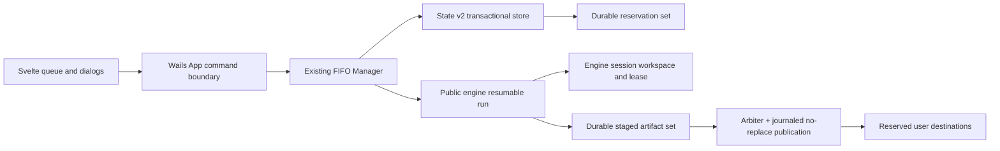

# VidStow concurrency and lifecycle technical implementation plan

Status: Confirmed for implementation

Product decisions: Confirmed on 2026-08-11

Implementation: Authorized by the project owner on 2026-08-11

Repositories: `github.com/tejasa97/youtube_dlp` and `github.com/tejasa97/vidstow`

## 1. Objective

Implement reliable Pause, Resume, Cancel, Retry, shutdown, restart recovery,
destination reservation, and no-replace publication while preserving VidStow's
existing queue:

- concurrency 1–10, default 2;
- one FIFO scheduler owned by `internal/jobs.Manager`;
- lowering the limit drains without preemption; and
- the existing FFmpeg semaphore remains a subordinate processing limit.

This plan translates the confirmed
[product contract](CONCURRENCY_LIFECYCLE_PLAN.md) and
[Decision 0001](decisions/0001-concurrency-lifecycle-v1.md) into repository,
API, data, migration, implementation, and validation work.

## 2. Authority and precedence

For this implementation:

1. Decision 0001 controls first-release product behavior.
2. The confirmed product plan controls visible lifecycle and queue semantics.
3. This document controls implementation sequencing and ownership.
4. Existing Pause/Resume artifacts remain useful protocol and filesystem
   references, but their automatic-overwrite and obsolete ticket assumptions
   do not apply.

In particular, resumable VidStow sessions always use no-replace publication.
No recovery path silently overwrites or silently renames an occupied target.

## 3. Audited baseline

The baseline was inspected on 2026-08-11.

### `youtube_dlp`

Reference baseline: `origin/main` at `e38820d`.

| Present | Evidence |
| --- | --- |
| Publication arbiter and typed atomic commit outcomes | PR #240, `engine/publication_arbiter.go`, `internal/atomicfile/` |
| Legacy multi-track workspace retention | PR #241, `engine/ntrack_workspace.go` |
| Context-aware FFmpeg process cancellation | PR #242 |
| Durable session manifest, workspace, lease, phases, and inspection | PR #243, `internal/session/` |
| Durable direct HTTP checkpoint primitive | PR #244 |
| Durable finite-fragment checkpoint primitive | PR #245 |

Still absent from the public session path:

- `FilesystemOptions.Resume` and typed Pause cause;
- a public session inspection/discard/GC facade;
- exact output preview/artifact declaration;
- app-supplied reserved commit targets;
- mandatory session staging and no-replace publication;
- session wiring for direct, multi-track, HLS, and DASH; and
- final crash reconciliation through the public engine runner.

PRs #244 and #245 were rebased, reviewed, and merged on top of PR #243. Their
checkpoint primitives remain internal prerequisites until the later phases
route them through session-owned paths; they must not reintroduce
destination-derived session state.

SABR/UMP remains a retained experimental engine extension. It is outside the
VidStow V1 product scope, implementation sequence, validation matrix, and
release gates. VidStow must not expose an output plan that depends exclusively
on SABR/UMP. This does not remove the experimental implementation from the
general engine.

### VidStow

Reference baseline: `codex/release-hardening` at `4f537e7`.

| Present | Current implementation |
| --- | --- |
| FIFO concurrency | `active` map plus `order` slice in `internal/jobs/jobs.go` |
| Limits | download 1–10/default 2; FFmpeg processing 3 |
| Pause/Cancel | generic `context.CancelFunc`, `pauseRequested` boolean |
| Retry | failed and canceled reuse the same job ID |
| Persistence | State v1; settings, history, and pending/active/paused jobs |
| Persistence cadence | 250 ms coalescing triggered by lifecycle and progress events |
| Shutdown | 3-second pause request followed by an unbounded `Close` join |
| Completion history | terminal event listener calls `AppendHistory` separately |
| Frontend | six statuses; phase/occupancy inferred from status and `processing` |

These are migration inputs, not alternative systems to retain alongside the
new design.

## 4. Target architecture



There is one queue scheduler and one session workspace per resumable job.
Session `ready-to-publish` state is also the durable staged-run state; do not
build a second app staging directory or a second publish lifecycle.

### Ownership

The engine owns:

- typed interruption causes;
- session paths, manifests, checkpoints, leases, and safe cleanup;
- protocol resume identity and validation;
- exact filename rendering through the engine template/sanitization rules;
- staged artifact construction;
- publication journaling, no-replace commit, rollback, and reconciliation; and
- safe, path-free session inspection results.

VidStow owns:

- FIFO order, concurrency, occupancy, and the FFmpeg capacity setting;
- logical job, attempt, and session references;
- cross-job reservation selection and persistence;
- State v2, lifecycle revisions, history, and cleanup tombstones;
- command acceptance, shutdown orchestration, and frontend outcomes; and
- when a user accepts a newly proposed destination after a collision.

VidStow continues to import only public `engine` and `providers/youtube`
packages. It never imports `youtube_dlp/internal/...`.

## 5. Public engine contract

The exact Go names may change during API review, but the capabilities and
failure semantics below are required.

### 5.1 Session-enabled request

```go
type ResumeOptions struct {
    SessionID          string
    PublicationArbiter *PublicationArbiter
    CommitTargets      []CommitTarget
}

type CommitTarget struct {
    Kind     ArtifactKind
    Identity string
    Basename string // one validated name, never an arbitrary path
}

type FilesystemOptions struct {
    // existing fields...
    Resume ResumeOptions
}
```

Rules:

- Empty `SessionID` preserves legacy engine behavior.
- Non-empty `SessionID` requires an arbiter and a complete declared target set.
- Session mode rejects `Overwrite: true` in favor of no-replace publication.
  VidStow must send `Overwrite: false`.
- The arbiter is created per worker attempt, shared by app and engine, and is
  never persisted or reused.
- Every target is a bounded basename. The engine derives the canonical output
  root from the request and validates all targets beneath it.
- The staged manifest must exactly match target kinds and identities before
  publication begins.

### 5.2 Typed interruption and result

```go
var ErrPauseRequested = errors.New("engine: pause requested")

type SessionOutcome struct {
    SessionID   string
    Disposition SessionDisposition
    Phase       SessionPhase
    Publication PublicationOutcome
    Cleanup     CleanupOutcome
}
```

VidStow uses `context.WithCancelCause`:

- Pause, Pause All, and ordinary shutdown send `ErrPauseRequested`.
- Cancel sends ordinary cancellation only after durable Cancel acceptance.
- The engine uses `context.Cause`, not only `ctx.Err`, to retain or discard.
- A result or typed error reports retained, discarded, cleanup-pending,
  collision, published, or recovery-required without exposing engine paths.

### 5.3 Exact output declaration

Export a network-free renderer that uses the exact engine template parser,
filesystem sanitization, analyzed metadata, and resolved final extension:

```go
type OutputPreviewRequest struct {
    Template  string
    Metadata  Info
    Extension string
}

type ArtifactDeclaration struct {
    Kind             ArtifactKind
    Identity         string
    ProposedBasename string
}

func RenderOutputArtifacts(OutputPreviewRequest) ([]ArtifactDeclaration, error)
```

The first VidStow release normally declares one primary artifact. The set is
kept generic so required sidecars can be added without changing reservation
or commit semantics.

The app never reimplements template expansion or filename sanitization.

### 5.4 Output-root and session maintenance facade

```go
type OutputRootRef struct {
    CanonicalPath string
    Identity      string // optional platform directory identity
}

func ValidateOutputRoot(path string) (OutputRootRef, error)
func InspectResumeState(ctx context.Context, root OutputRootRef, sessionID string) (ResumeSummary, error)
func PrepareResumeDiscard(ctx context.Context, root OutputRootRef, sessionID string) (ResumeDiscardHandle, error)
func CollectResumeOrphans(ctx context.Context, root OutputRootRef, live map[string]struct{}, olderThan time.Time) (CollectionResult, error)
```

All return values are bounded and path-safe. No method returns private workspace
paths, signed URLs, headers, cookies, keys, or tokens.

### 5.5 Staging and publication

For every session-enabled output shape:

1. protocol adapters write only coordinator-supplied workspace paths;
2. completed inputs remain intact;
3. the engine builds and fingerprints a durable staged artifact set;
4. the manifest commits `ready-to-publish`;
5. the engine acquires `BeginPublication`;
6. a publish journal records each no-replace move;
7. success becomes the publication winner before result delivery; and
8. completion cleanup occurs only after VidStow atomically records completion.

For a multi-artifact set, a collision rolls back already published engine-owned
paths to staging before returning. Outcomes:

- complete rollback: typed destination collision; staged state remains
  retryable under the same session without transfer or processing;
- unproved rollback or atomic authority: typed recovery-required; preserve all
  evidence and block mutation; and
- complete publish: return success only after the journal is durable.

A collision releases the worker slot after the runner exits. When the user
accepts a new reservation, the same logical job/session re-enters the FIFO tail;
the engine reopens `ready-to-publish` and performs publication only.

## 6. VidStow durable model

Move durable types out of `internal/jobs` into a manager-independent package,
for example `internal/jobmodel`, so `store` and `jobs` do not form a cycle.

### 6.1 State v2

```go
type State struct {
    Version          int
    StoreRevision    uint64
    NextQueueOrdinal uint64
    Settings         Settings
    Jobs             []DurableJob
    History          []HistoryEntry
    Cleanup          []CleanupTombstone
}

type DurableJob struct {
    ID                 string
    Revision           uint64
    AttemptID          string
    SessionID          string
    QueueOrdinal       uint64
    Lifecycle          Lifecycle
    Phase              Phase
    Desired            DesiredState
    Request            PersistedRequest
    Plan               PersistedPlan
    OutputRoot         OutputRootRef
    Reservation        ReservationSet
    RetryMode          RetryMode
    ActionRequiredCode string
    LastErrorCode      string
    CreatedAt          time.Time
    UpdatedAt          time.Time
}
```

These are VidStow-owned persistence DTOs. Map safe fields from public engine
results into them; do not serialize engine structs directly into State v2.

Do not persist speed, ETA, animation messages, `occupiesSlot`, arbitrary error
text, signed media URLs, cookies, headers, or credentials. The existing private
format selector may remain in the owner-only state only after a specific
safe-field review.

### 6.2 Reservation set

```go
type ReservationSet struct {
    GroupID   string
    Directory OutputRootRef
    Artifacts []ReservedArtifact
}

type ReservedArtifact struct {
    Kind     ArtifactKind
    Identity string
    Basename string
}
```

Admission chooses one suffix for the entire artifact set. It checks:

- every current filesystem target using no-follow inspection;
- every reservation held by pending, active, pausing, paused, canceling,
  failed-retryable, or action-required jobs; and
- reservations retained by cleanup tombstones.

The reservation is committed in the same State transaction that admits the
job. The manager sees the job only after commit.

### 6.3 Cleanup tombstone

```go
type CleanupTombstone struct {
    JobID              string
    SessionID          string
    OutputRoot         OutputRootRef
    Reservation        ReservationSet
    State              CleanupState // pending | quarantined
    LastErrorCode      string
    CreatedAt          time.Time
    UpdatedAt          time.Time
}
```

Completion or Cancel removes the live session reference and creates/updates the
tombstone atomically. Cleanup success removes the tombstone later.

### 6.4 Store transaction

All settings, job, history, reservation, and tombstone writes use one internal
commit primitive:

```go
type JobPrecondition struct {
    ID         string
    Revision   uint64
    Lifecycle  Lifecycle
    SessionID  string
    OutputRoot OutputRootRef
}

type CommitError interface {
    error
    Committed() bool
    Indeterminate() bool
}
```

Implementation order:

1. process-local store mutex;
2. permanent owner-only sibling `state.json.lock` advisory lock;
3. reread and strictly validate the latest State;
4. deep-clone, check preconditions, and mutate only the clone;
5. serialize to a unique owner-only same-directory temp and fsync it;
6. atomically replace `state.json` using local Unix/Windows adapters;
7. adopt the clone in memory immediately after the replace commit point; and
8. fsync the parent where supported, then release locks in reverse order.

VidStow implements its own app-owned atomic adapter under `internal/store`.
It cannot import the engine's internal utility. Both implementations must share
the same documented outcome semantics and portable fault-injection vectors.

Pre-commit failure leaves old disk and memory authoritative. Post-commit
durability uncertainty adopts the new image and warns. Indeterminate authority
preserves evidence, retains the stable lock, and enters recovery-required mode.

## 7. Runtime manager model

The current `Manager`, `active` map, FIFO `order`, and processing semaphore are
retained and evolved. Do not create a replacement queue manager.

### 7.1 Runtime-only worker

```go
type worker struct {
    JobID      string
    AttemptID  string
    SessionID  string
    Cancel     context.CancelCauseFunc
    Arbiter    *engine.PublicationArbiter
    Done       chan struct{}
}
```

`active map[string]*worker` is the sole occupancy authority. A job remains in
the map through transfer, waiting for FFmpeg, finalization, pausing, and
canceling until the runner and lease have exited.

No store call, engine lease acquisition, arbiter wait, worker join, or cleanup
wait occurs while `m.mu` is held.

### 7.2 Durable lifecycle and phase

| Lifecycle | Occupies slot | Allowed primary actions |
| --- | --- | --- |
| pending | no | Pause, Cancel |
| active | yes | Pause, Cancel |
| pausing | yes until runner exit | none |
| paused | no | Resume, Cancel |
| canceling | yes until runner exit; no during detached cleanup | none |
| failed | no | Retry, Remove |
| canceled | no | Download again, Remove |
| completed | no | Open, Remove |
| action-required | no | Review safe action, Remove only when allowed |

Phase is separate: preparing, downloading, waiting-for-processing, finalizing,
ready-to-publish, publishing, and cleaning-up. Persist phase only at durable
engine boundaries; transient labels remain presentation state.

### 7.3 Command protocol

Every lifecycle command follows the same shape:

1. validate and snapshot job/worker/revision under `m.mu`;
2. install a short process-local operation token when needed;
3. release `m.mu`;
4. acquire any arbiter/session handle in the documented lock order;
5. commit the expected-revision State transition;
6. on committed or durability-uncertain success, update the runtime mirror and
   emit the accepted state;
7. signal the worker only after durable acceptance; and
8. settle asynchronously, commit the final state, release occupancy, then
   start the next FIFO job.

Attempt IDs are checked on every engine event and terminal callback. Events
from a superseded attempt are ignored and never mutate progress or lifecycle.

## 8. Core flows

### 8.1 Admission and Start

1. Resolve the selected public output plan from analyzed metadata.
2. Ask the engine renderer for the exact artifact declaration.
3. Validate/canonicalize the output root through the public engine helper.
4. Under the State lock, choose the first whole-set suffix not occupied by disk
   or durable reservations.
5. Persist new job ID, attempt ID, session ID, FIFO ordinal, lifecycle pending,
   and `ReservationSet` in one transaction.
6. Admit the committed job to the existing manager and fill an available slot.
7. Before starting the goroutine, commit pending to active with a new attempt.
8. Create one arbiter and cancel-cause context; pass the exact targets in
   `ResumeOptions`.

A crash after active commit but before goroutine start restores through normal
active-job reconciliation and never assumes a live slot.

### 8.2 Pause and Resume

Pending Pause is one State transition and FIFO removal.

Active Pause:

1. commit active to pausing with desired paused;
2. call `cancel(engine.ErrPauseRequested)`;
3. keep the worker in `active` until the engine closes handles, commits the last
   safe checkpoint, and releases the session lease;
4. commit paused and remove occupancy; and
5. start the next FIFO job.

Resume assigns a new attempt ID and FIFO ordinal, commits pending, and joins the
tail. The same session and reservation are retained.

### 8.3 Cancel

Local runner:

1. snapshot worker, arbiter, revision, session, and root;
2. call `BeginCancel` outside `m.mu`;
3. commit canceling with the expected revision while retaining the reservation;
4. pre-commit failure calls `AbortCancel` and does not signal;
5. committed success calls `WinCancel`, then signals ordinary cancellation;
6. wait outside locks for runner/lease exit;
7. acquire a discard handle and clean; and
8. atomically commit canceled plus cleanup tombstone as required.

No local runner:

1. install a local Start/Resume probe;
2. call `PrepareResumeDiscard` before State mutation;
3. retain the handle while conditionally committing canceling;
4. stale/pre-commit failure releases without deletion; and
5. committed success discards and terminalizes asynchronously.

If publication already won, reconcile Completed. If publication is in progress,
return a retryable result without recording Cancel. If authority is
indeterminate, enter action-required/recovery-required and preserve evidence.

### 8.4 Failed Retry

Before enqueueing, inspect the session through the public engine facade:

- reusable: retain session and reservation;
- safely restartable/absent: allocate a new session, retain the logical job,
  and preserve or re-reserve the destination set atomically;
- needs reconciliation: move to action-required; and
- published evidence: reconcile completion.

Retry always receives a new attempt ID and FIFO ordinal.

### 8.5 Download again

Clone only the original safe request and plan inputs. Use the normal admission
path to create a new job, attempt, session, reservation, and FIFO ordinal. The
canceled row remains until Clear Completed or explicit removal.

### 8.6 Pause All

Snapshot all eligible revisions, then commit one batch transition:

- pending becomes paused immediately;
- active becomes pausing; and
- finalizing may become pausing but can still reconcile Completed if
  publication wins.

Signal only workers whose durable transition committed. Return accepted counts
and per-job exceptions. Rows settle independently.

### 8.7 Destination collision

If no-replace publication finds an external collision:

1. the engine rolls back any partial artifact set to durable staging;
2. the runner returns a typed collision with safe artifact identities;
3. VidStow commits action-required/ready-to-publish and releases the slot after
   runner exit;
4. Review computes the next suffix as a non-authoritative preview;
5. Use new name rechecks disk and reservations under the State lock, atomically
   swaps the reservation set, and enqueues the same job/session at the tail; and
6. the next engine run publishes from retained staging without transfer or
   processing.

If the preview became stale, return the next suffix and keep the job
action-required. Never overwrite or silently choose for the user.

### 8.8 Ordinary quit

Use Wails `OnBeforeClose` as the interception point:

- if no worker occupies a slot, permit close;
- otherwise emit a quit-request event and prevent close;
- the confirmed modal offers Keep working or Pause downloads and quit;
- confirmation stops admission and commits pending/active jobs to paused or
  pausing in one bounded operation;
- active workers receive `ErrPauseRequested` and share one shutdown deadline;
- finalization may complete; on deadline FFmpeg is canceled, completed inputs
  are retained, and finalization restarts later; and
- after the bounded shutdown result, set a one-shot close permit and call the
  Wails quit API.

`OnShutdown` remains an idempotent safety net. Replace the current unbounded
`Close` join with a context-bounded close; unfinished transitional state is
reconciled on next startup.

## 9. Startup and recovery order

Healthy startup is strictly ordered:

1. open and owner-validate the config directory and `state.json.lock`;
2. load or migrate State under the stable lock;
3. recover engine publish journals before starting any worker;
4. reconcile active, pausing, canceling, ready-to-publish, and published jobs
   using session leases and durable evidence;
5. commit reconciliation transitions;
6. construct the manager from the committed snapshot with zero occupied slots;
7. restore pending/active interrupted jobs as paused;
8. build live session sets grouped by canonical output root; and
9. run bounded session/lock orphan collection.

Corrupt JSON, unknown version, failed migration, unsafe permissions, or
indeterminate State commit enters recovery-required mode. Preserve the original
bytes and evidence; do not start runners, cleanup, reconciliation, or GC; do not
fall back to a default/ephemeral authoritative store.

## 10. State v1 to v2 migration

Migration runs once under `state.json.lock` and creates an owner-only,
fsynced pre-v2 backup for manual rollback.

- Preserve settings, history, queue identity, safe request fields, and private
  plan fields after review.
- Remove `RestoreInterruptedJobs` from the active Settings model; its old value
  does not disable restoration.
- Convert every pending or active job to paused.
- Preserve already paused jobs as paused.
- Assign revision, attempt ID, session ID, and output-root identity.
- Re-render and reserve the exact destination set. If required inputs are
  insufficient or collision authority is unclear, migrate the row to
  action-required rather than guessing.
- Do not adopt legacy destination-derived `.part`, fragment, SABR, or
  `.ytdlp-formats-*` state into a session workspace.
- A migrated legacy job starts from zero in a new session when resumed and
  tells the user that older saved progress could not be verified.
- Do not automatically delete legacy partial artifacts whose ownership cannot
  be proved.

State v2 is not downgrade-compatible. Restoring the pre-v2 backup is the manual
rollback path; an older app must never be pointed at migrated State v2 as if it
were State v1.

## 11. Implementation sequence

Each phase has one owner and an explicit gate. Later phases may be developed in
parallel only after their input contract is frozen.

### Phase E0 — Integrate current engine prerequisites

Repository: `youtube_dlp`

Status: Complete in PRs #244 and #245.

- rebase, review, and merge the direct and fragment checkpoint branches onto
  current `origin/main`;
- make both opt-in primitives accept caller-owned checkpoint directories;
- use the shared atomic commit utility for durable checkpoint state;
- preserve existing nil-checkpoint behavior; and
- add race, Windows, and fault-injection tests after rebase.

Gate: no session package deletion/regression; checkpoint branches pass full and
race tests on the PR #243 baseline.

Routing those caller-owned directories through public session-enabled engine
runs belongs to E2 for direct transfers and E4 for finite fragments.

### Phase E1 — Public session and output-planning facade

Repository: `youtube_dlp`

Likely files:

- `engine/options.go` — `ResumeOptions` and commit targets;
- new `engine/resume.go` — typed causes, inspection, discard, and GC facades;
- new `engine/output_preview.go` — exact artifact renderer;
- `engine/client.go` / coordinator — session opt-in and result mapping; and
- public API/dependency tests proving no internal type leaks.

Gate: empty session is behavior-compatible; non-empty invalid combinations fail
before filesystem/network effects.

### Phase E2 — Direct staged session and no-replace publication

Repository: `youtube_dlp`

- wire direct checkpoints to session components and provider identity;
- build `publish/final.staged` while retaining completed payload;
- add durable publish journal and no-replace target commit;
- wire PublicationArbiter across replace and manifest commit;
- implement collision rollback and ready-to-publish retry; and
- reconcile every crash point before/after destination publication.

Gate: direct range fixture pauses across restart and token rotation; target is
never overwritten; retry after collision performs no transfer.

### Phase E3 — Multi-track and processing integration

Repository: `youtube_dlp`

- migrate session-enabled runs away from `.ytdlp-formats-*`;
- use one lease and independent component checkpoints;
- retain completed inputs while FFmpeg is canceled/restarted;
- route every final output through the same stage/publish journal; and
- preserve legacy n-track behavior only for non-session requests.

Gate: audio/video components resume independently; shutdown during FFmpeg
reprocesses without retransferring.

### Phase E4 — HLS and DASH session integration

Repository: `youtube_dlp`

- wire fragment checkpoints into coordinator-supplied paths;
- permit cross-refresh VOD reuse only with remote byte-equivalence proof;
- keep live HLS/dynamic DASH within-run only;
- treat unsupported encryption/key identity conservatively; and
- use the common staging/publication funnel.

Gate: unchanged bytes resume; structurally identical but changed bytes restart;
no checkpoint serializes URLs, keys, cookies, or headers.

### Phase E5 — Engine hardening and tagged release

Repository: `youtube_dlp`

- cross-process lease/GC tests;
- Unix and native Windows atomic matrices;
- publication collision/rollback/recovery fuzz and crash tests;
- direct, multi-track, HLS, and DASH combined tests; and
- public documentation and compatibility notes.

Gate: merge to `main`, publish a tagged engine release, and pin VidStow to that
tag. Do not integrate VidStow against an unmerged pseudo-version for release.

### Phase V0 — State v2 foundation

Repository: `vidstow`

Likely files/packages:

- new `internal/jobmodel/` durable types;
- split `internal/store/` into schema, migration, lock, atomic platform, and
  transition files;
- `internal/store/*_test.go` plus subprocess lock helpers; and
- startup status types for healthy versus recovery-required.

Land the store unused by the live manager until the cutover phase. This keeps
the existing queue behavior stable while the transaction layer is reviewed.

Gate: v1 migration, deep-clone, stale revision, pre/post/indeterminate commit,
cross-process, permissions, and corrupt-State tests pass on macOS and Windows.

### Phase V1 — Reservation and admission

Repository: `vidstow`

- add pure whole-set suffix selection and no-follow disk checks;
- call the public engine renderer;
- commit reservation plus job before manager admission;
- retain reservations through paused, failed, action-required, and tombstone
  states; and
- preserve the current FIFO scheduling code.

Gate: simultaneous admission cannot choose the same path; suffixing is stable
across restart and case-insensitive platforms.

### Phase V2 — Existing manager lifecycle cutover

Repository: `vidstow`

- refactor `jobs.go` without replacing `Manager`;
- replace `context.WithCancel` with cancel causes;
- replace `pauseRequested` with durable lifecycle/desired state;
- change `active` values to attempt-scoped workers with arbiters;
- remove coalesced full-State writes from progress events;
- make completion/history/tombstone one store transaction;
- implement Retry versus Download again identities; and
- implement local/no-local-runner Cancel protocols.

Gate: existing FIFO/concurrency tests remain green plus full lifecycle race and
winner matrices.

### Phase V3 — Startup, shutdown, and cleanup

Repository: `vidstow`

- strict startup/recovery order;
- recovery-required app mode;
- `OnBeforeClose` confirmation flow;
- bounded manager shutdown and close;
- cleanup tombstone worker and orphan collection; and
- native process tests for cross-process Resume/Cancel contention.

Gate: no unbounded shutdown wait; crash/restart produces one truthful terminal
winner and never runs GC against unknown State.

### Phase V4 — Frontend contract

Repository: `vidstow`

- extend `JobStatus` with pausing, canceling, and action-required;
- add phase, occupancy, queue position, and safe action capabilities;
- return a backend-authored `QueueView` with aggregate counts;
- update `ProgressRow`, `StatusBadge`, Queue, Settings, and dialogs to the
  confirmed mockups;
- remove the restoration setting from Go and TypeScript models; and
- add Download again, destination Review, quit, and recovery-required methods.

Prefer backend capability flags over duplicating lifecycle action rules in
Svelte.

Gate: UI contract tests cover every lifecycle/phase/occupancy combination,
keyboard behavior, disabled actions, exact copy, and 1000×640 layout.

### Phase V5 — Combined hardening and release

Repositories: both

- run the acceptance matrix in section 12;
- run native Windows, macOS, and Linux filesystem/shutdown coverage;
- measure State commits under several progress streams;
- verify no global session lock serializes independent jobs;
- update README screenshots and user documentation; and
- publish VidStow only after its pinned engine tag and migration artifacts are
  reproducible.

## 12. Validation matrix

### Engine

- direct range resume with strong validator and rotated URL;
- independent audio/video checkpoint and merge restart;
- session-mode HLS VOD and static DASH recovery;
- conservative restart for changed remote bytes, live HLS, dynamic DASH, and
  unsupported encrypted identity;
- pause/cancel/publication arbiter interleavings;
- no-replace single and multi-artifact collisions;
- complete rollback versus recovery-required rollback;
- manifest/payload/publish crash points;
- path traversal, symlink, case, reserved-name, and root-identity attacks;
- session lease contention and process-death recovery; and
- GC only for valid, unreferenced, older-than-seven-day sessions.

### VidStow store and manager

- State v1 migration and pre-v2 backup;
- corrupt/unknown/migration-failed recovery-required mode;
- stale expected revisions and attempt-event rejection;
- default 2 and limits 1–10;
- FIFO and lowering 4 to 1 without interruption;
- Pause/Cancel release slots only after runner exit;
- Pause All mixed outcomes;
- Failed Retry and canceled Download again identities/order;
- completion/history/tombstone idempotency;
- external collision followed by user-approved suffix and publish-only retry;
- shared-deadline quit during transfer and FFmpeg;
- concurrent processes using one State and one output root; and
- several progress streams without lifecycle revision/write churn.

### Frontend

- queue summary equals backend occupancy and counts;
- Next/Position ordering;
- Pausing, Canceling, Finalizing, Cleaning up, and Action required;
- Failed shows Retry; Canceled shows Download again;
- Settings has fixed Restored as paused behavior and no toggle;
- quit dialog has only Keep working and Pause downloads and quit;
- recovery-required exposes diagnostics/data folder only; and
- destination conflict has no Replace action.

### Commands

VidStow release candidate:

```sh
gofmt -w .
go mod tidy -diff
go vet ./...
go test -count=1 ./...
go test -race -count=1 ./...
go build ./...

cd frontend
npm ci
npm run check
npm run test:ui
npm run build
```

Run `wails build` where native tooling is available. Engine phases run their
repository-wide vet, unit, race, build, and platform-specific suites.

## 13. Release and rollback

- Engine session behavior is opt-in until VidStow pins the completed tag.
- VidStow does not ship a mixed mode where some jobs use State v1 and others use
  sessions/State v2.
- The v2 migration happens only in the release containing the complete manager,
  startup, and UI cutover.
- Keep the pre-v2 State backup and expose its path only through diagnostics.
- A release rollback requires closing VidStow and manually restoring the v1
  backup; no automatic downgrade is claimed.
- Never delete session or journal evidence during rollback when ownership or
  publication authority is uncertain.

## 14. Primary risks and controls

| Risk | Control |
| --- | --- |
| Dual staging/session systems | Treat session ready-to-publish state as the only durable staged-run state |
| Filename drift between app and engine | Use one public engine renderer and exact manifest/target identity matching |
| Lost Cancel or false completion | Expected revisions plus shared per-attempt publication arbiter |
| Slot released before resource ownership ends | Delete from `active` only after runner and lease exit |
| State write amplification | No lifecycle commit for progress, speed, ETA, or presentation messages |
| Cross-process lost updates | Stable sibling lock, reread-under-lock, full-image atomic commit |
| Unsafe recovery from corrupt State | Blocking recovery-required mode; no default/ephemeral fallback or GC |
| Old partials mistaken for sessions | No automatic adoption; migrated jobs restart under new sessions |
| Windows semantic drift | Native Windows adapters and fault-injection tests in both repositories |
| Throughput loss during finalization | Accepted v1 behavior; measure before considering separate capacity later |

## 15. Technical review checklist

- [ ] Public engine API names and safe returned fields are approved.
- [ ] Session staging and the exact-output reservation contract are confirmed as
  one path, not two implementations.
- [x] Direct/fragment prerequisites are rebased, reviewed, and merged on top of
  PR #243.
- [ ] State v2 schema and v1 migration behavior are approved.
- [ ] App-owned atomic adapter and shared outcome test vectors are approved.
- [ ] Manager lock order and async Cancel flows have been race-reviewed.
- [ ] `OnBeforeClose` and bounded shutdown behavior are validated on all Wails
  platforms.
- [ ] Engine phase gates are complete before VidStow pins a release.
- [ ] All confirmed mockups map to backend fields and command outcomes.
- [ ] No phase creates a second scheduler or silently overwrites a destination.

Implementation assignments derive from these phases and the accepted decision
record. Do not derive work from the obsolete ticket numbering.
